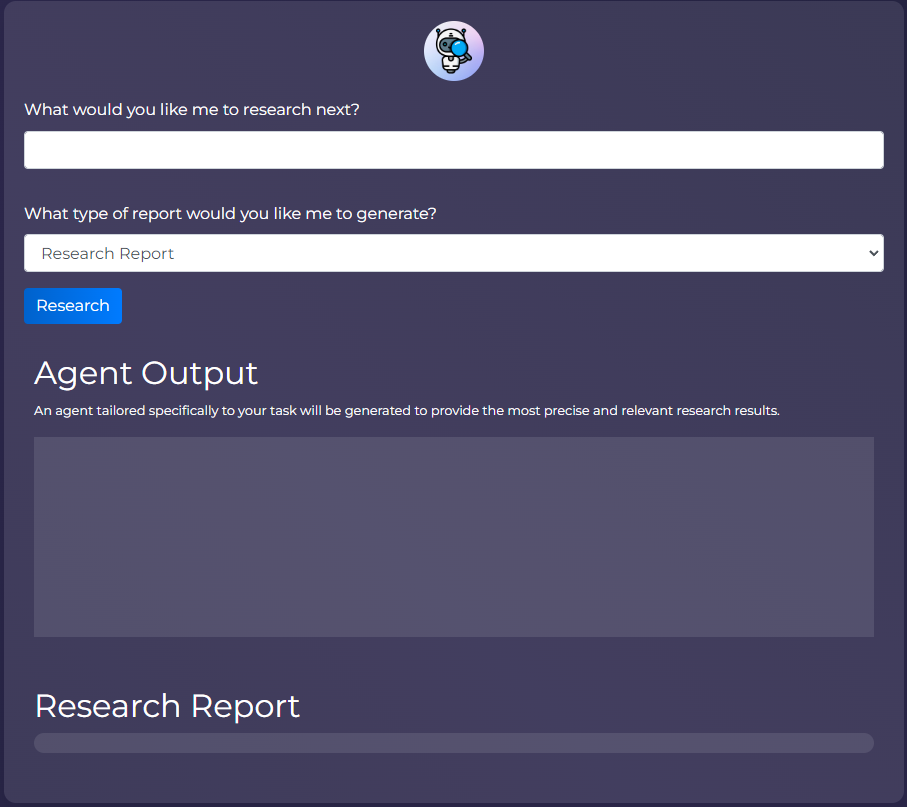

# GPT researcher CI/CD pipeline

Deploy GPT researcher server with CI/CD on Elestio

 
 

# Setting Up API Keys for Self-Hosted GPT Researcher

To utilize the self-hosted GPT researcher, you'll need two essential API keys: Tavily and OpenAI. Follow the steps below to obtain and configure these keys:

## Obtaining Tavily API Key

Register on the Tavily platform by visiting <a target="_blank" href="https://app.tavily.com/sign-in
">Tavily Registration</a>.

Once registered, retrieve your Tavily API key.

## Obtaining OpenAI API Key

Register on the OpenAI platform by visiting <a target="_blank" href="https://platform.openai.com/"> OpenAI Platform Registration</a>.
After registration, obtain your OpenAI API key.

## Updating Environment Variables

After obtaining both API keys, it's time to update the environment variables in your Elestio dashboard. Follow these steps:

- Navigate to the Elestio dashboard.
- In the "Service Overview" section, locate and click on the "UPDATE CONFIG" button.
- Go to the "Env" tab.
- Update the environment variables with your newly acquired credentials.

## Configuring API Keys

Copy the Tavily API Key and OpenAI API Key values to the respective variables:

    TAVILY_API_KEY
    OPENAI_API_KEY

## Finalizing Configuration

Click on the "Update & Restart" button to apply the changes and ensure seamless integration with the self-hosted GPT researcher.

Your GPT researcher is now configured with the required API keys, ready to deliver exceptional performance.

# Once deployed ...

You can open GPT researcher UI here:

    URL: https://[CI_CD_DOMAIN]
    login: root
    password: [ADMIN_PASSWORD]
